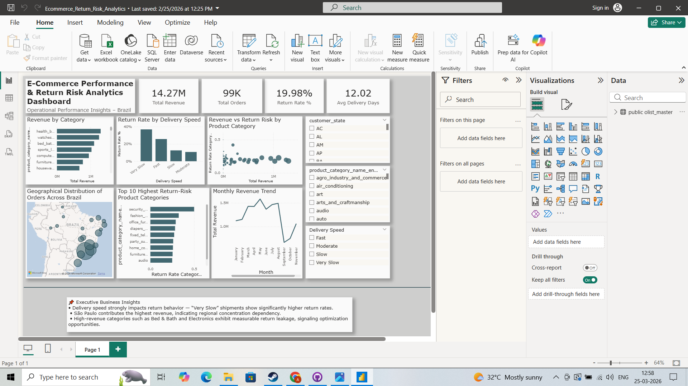

# 📊 E-Commerce Return Risk & Profitability Analysis

## 🚀 Project Overview

This project delivers an end-to-end data analytics solution to uncover key drivers of **return risk, revenue trends, and profitability leakage** in an e-commerce business.

By integrating **Python, SQL, and Power BI**, the analysis transforms raw transactional data into actionable business insights, enabling data-driven decision-making for operations, logistics, and revenue optimization.

---

## 🎯 Business Problem

E-commerce businesses often face significant losses due to:

- High product return rates  
- Inefficient delivery systems  
- Regional performance imbalances  

This project aims to:

- Identify **factors influencing return risk**  
- Analyze **revenue distribution across categories and regions**  
- Quantify **profitability loss due to returns**  
- Provide **strategic recommendations for optimization**  

---

## 🧰 Tools & Technologies

- **Python** (Pandas, NumPy)  
- **SQL (PostgreSQL)**  
- **SQLAlchemy**  
- **Power BI**  
- **Jupyter Notebook**  

---

## 📂 Dataset

- Brazilian E-Commerce Public Dataset (Olist)

Includes:
- Orders, Customers, Products  
- Payments, Reviews, Sellers  
- Geolocation & Category Translation  

---

## 🧪 Key Analysis Performed

### 🔹 Data Preparation

- Merged multiple datasets into a unified analytical table  
- Handled missing values and datatype conversions  
- Engineered key features:
  - `delivery_days`
  - `late_delivery`
  - `return_risk`
  - `total_order_value`

---

### 🧹 Data Preparation Summary

- Joined multiple relational tables into a master dataset
- Handled missing values and inconsistent formats
- Created analytical features such as:
  - Delivery time
  - Return risk indicator
  - Order value metrics

---

### 🔹 Exploratory Data Analysis (EDA)

- Revenue trends over time  
- Category-wise revenue contribution  
- Geographic revenue distribution  
- Delivery performance analysis  

---

### 🔹 Advanced SQL Analytics

- Monthly revenue trend analysis  
- Revenue by customer state  
- Return risk percentage by region  
- Revenue loss due to return-risk orders  
- Impact of delivery speed on return rates  

---

### 🧠 SQL Skills Demonstrated

- Complex aggregations with `GROUP BY`
- Conditional filtering using `CASE` and `FILTER`
- KPI calculations (return rate %, loss %)
- Time-series analysis
- Business-focused metric engineering

---

## 📊 Dashboard Preview



---

## 📈 Key Insights

- 📈 **Strong Growth Trajectory**: Revenue increased rapidly during 2017–2018, followed by stabilization  
- 🛍️ **Top Categories**: Health & Beauty, Watches & Gifts, and Bed & Bath drive maximum revenue  
- 🌍 **Geographical Concentration**: São Paulo dominates revenue contribution  

- ⚠️ **Return Risk Drivers**:
  - Late deliveries significantly increase return probability  
  - Low review scores strongly correlate with returns  

- 🚚 **Logistics Impact**:
  - “Very Slow” deliveries have ~4x higher return rates than fast deliveries  

- 💸 **Profitability Leakage**:
  - High-revenue categories also experience significant return-related losses  

---

## 💡 Business Recommendations

- Optimize delivery performance to reduce return risk  
- Improve product quality and descriptions to minimize dissatisfaction  
- Focus on high-performing categories for revenue growth  
- Strengthen logistics in high-risk regions  
- Monitor return risk as a core business KPI  

---

## 📁 Project Structure

```
ecommerce-returns-profitability-analysis/
│
├── data/
│   └── Brazilian E-Commerce Public Dataset (Olist)
│       ├── master_olist.csv
│       ├── olist_customers_dataset.csv
│       ├── olist_geolocation_dataset.csv
│       ├── olist_order_items_dataset.csv
│       ├── olist_order_payments_dataset.csv
│       ├── olist_order_reviews_dataset.csv
│       ├── olist_orders_dataset.csv
│       ├── olist_products_dataset.csv
│       ├── olist_sellers_dataset.csv
│       └── product_category_name_translation.csv
│
├── notebooks/
│   └── analysis.ipynb
│
├── dashboard/
│   └── Ecommerce_Return_Risk_Analytics.pbix
│
├── images/
│   └── ecom_returns_dashboard.png
│
├── sql/
│   └── olist_database_backup
│
├── requirements.txt
└── README.md
```

---

## ⚙️ How to Run This Project

1. Clone the repository  

```
git clone https://github.com/anirban-analytics/ecommerce-returns-profitability-analysis.git
```

2. Install dependencies  

```
pip install -r requirements.txt
```

3. Restore the database (PostgreSQL)  

- Use the backup file located in the `sql/` folder  
- Restore using pgAdmin or `psql`  

4. Open the Jupyter Notebook  

```
jupyter notebook
```

5. Run all cells to reproduce analysis  

---

## 📌 Key Metrics Tracked

- Total Revenue  
- Total Orders  
- Return Rate (%)  
- Average Delivery Time  
- Revenue Loss (%)  

---

## 💰 Business Impact

This analysis helps e-commerce businesses:

- Reduce return-related revenue loss by identifying high-risk categories  
- Improve customer satisfaction through optimized delivery performance  
- Enhance operational efficiency in logistics and fulfillment  
- Prioritize high-value regions and product segments for growth  

> 📊 Estimated Impact: Reducing return rates in high-risk segments can significantly improve overall profitability.

---

## 🎯 Project Outcome

This project demonstrates how data analytics can:

- Identify operational inefficiencies  
- Reduce revenue leakage  
- Improve customer experience  
- Enable strategic decision-making  

---

## 🚀 Future Improvements

- Add predictive modeling for return probability  
- Build automated data pipelines  
- Deploy dashboard using Power BI Service  
- Integrate real-time data sources  

---

## 👤 Author

**Anirban Tarafdar**  
Aspiring Data Analyst | SQL | Python | Power BI  

---

## ⭐ If You Found This Useful

Give this repo a ⭐ and feel free to connect!
